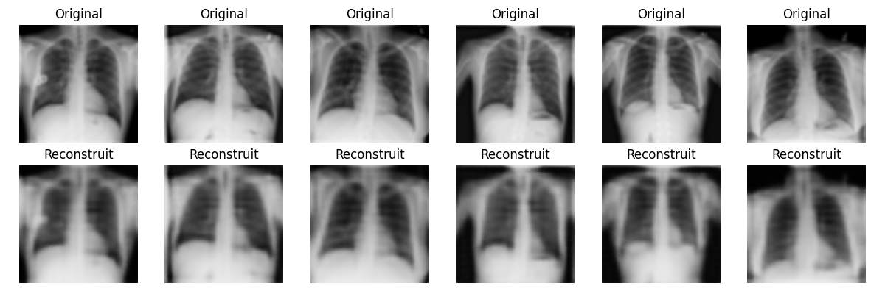
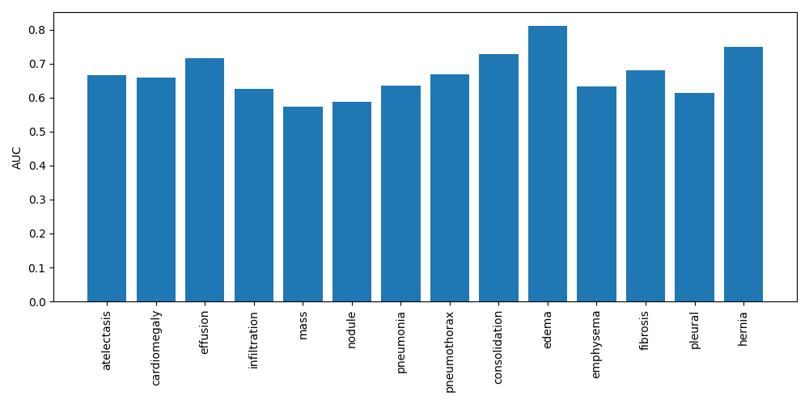
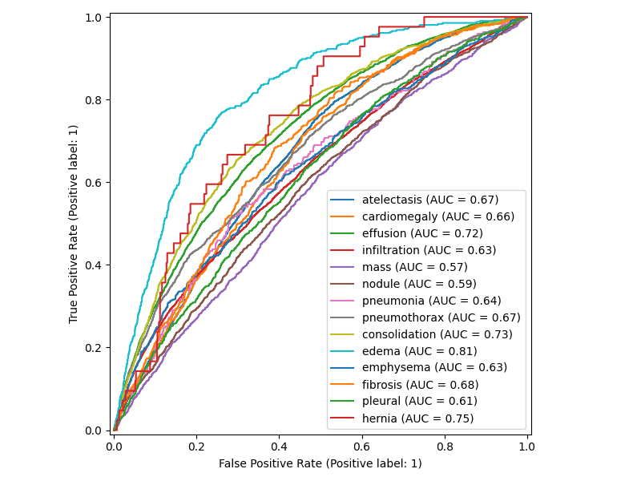
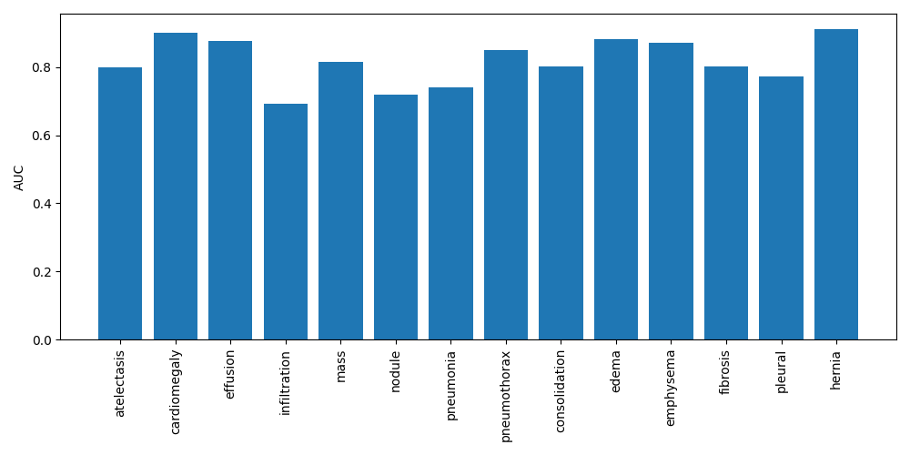
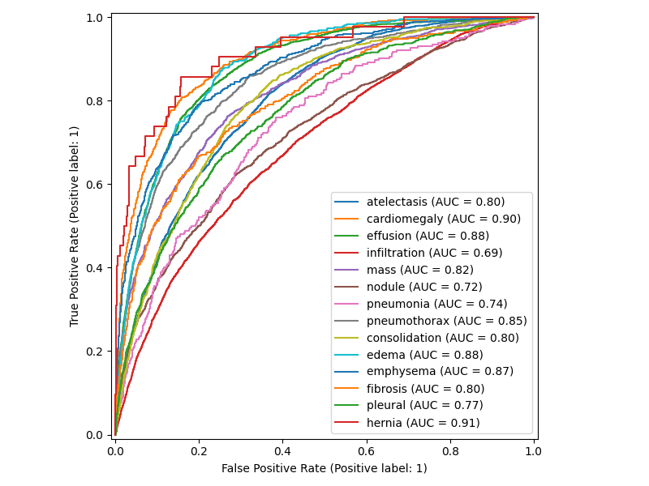
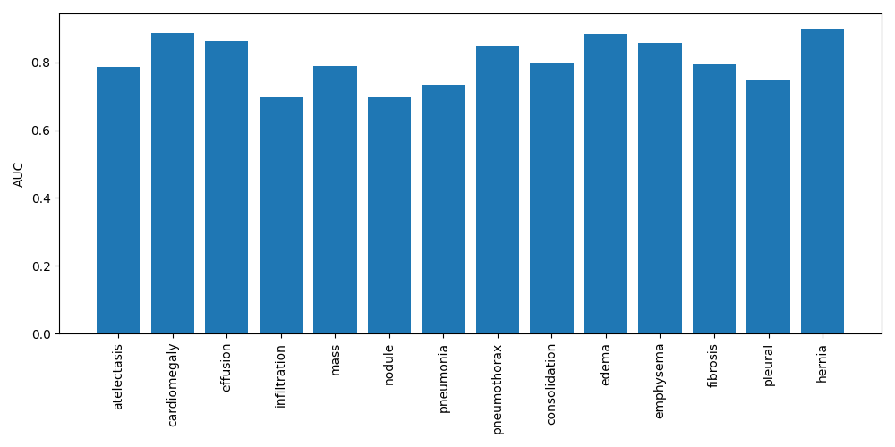
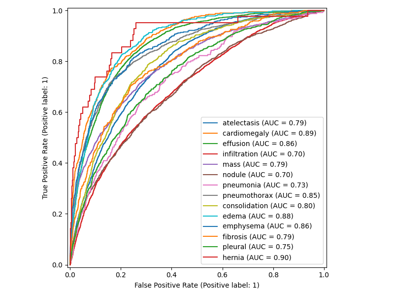
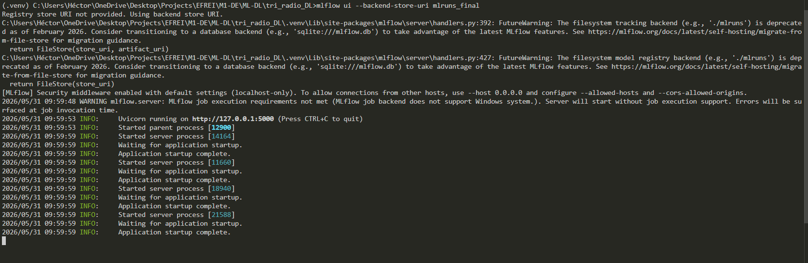
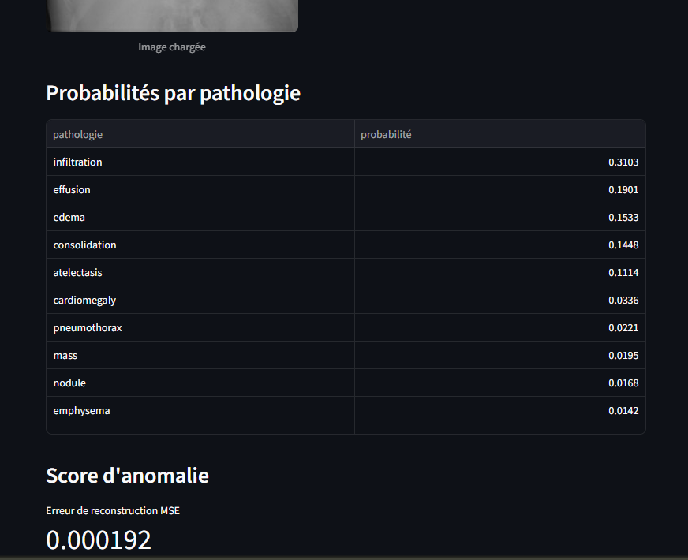

# Rapport - Système d'aide au tri radiologique thoracique

## 1. Problème

Le projet porte sur un système d'aide au tri radiologique à partir de radiographies thoraciques. L'objectif n'est pas de produire un diagnostic automatique, mais de prioriser ou signaler des cas potentiellement importants dans un cadre pédagogique.

La tâche principale est une classification multi-label : une même radiographie peut être associée à plusieurs pathologies. Le modèle produit donc 14 scores indépendants, un par label, avec une activation sigmoïde en sortie pour l'inférence. Pendant l'entraînement, la fonction de coût utilisée est `BCEWithLogitsLoss`, car elle combine de façon stable les logits et la binary cross entropy.

## 2. Données

Le dataset principal est ChestMNIST, fourni par MedMNIST. Ce choix respecte la contrainte du sujet et évite de construire manuellement un split, puisque MedMNIST fournit déjà des ensembles train, validation et test.

ChestMNIST contient des radiographies thoraciques en niveaux de gris et 14 labels de pathologies. Les labels sont déséquilibrés, ce qui rend l'accuracy peu informative. Les métriques retenues sont donc l'AUC macro, l'AUC par classe, le F1-score macro, la précision macro, le rappel macro et la loss de validation.

Pour la partie multimodale, le projet prévoit OpenI. Ce choix est plus réaliste pour un binôme étudiant que MIMIC-CXR, car OpenI est plus simple à préparer localement. Cette partie est une preuve de concept : elle ne remplace pas ChestMNIST pour la classification supervisée obligatoire.

## 3. Analyse exploratoire

L'analyse exploratoire prévue dans `notebooks/01_eda_chestmnist.ipynb` vérifie :

- le nombre d'images dans les splits train, validation et test ;
- la prévalence des 14 labels ;
- quelques exemples de radiographies ;
- le déséquilibre entre classes.

Les observations attendues sont un déséquilibre marqué et des co-occurrences possibles entre pathologies. Ces éléments justifient l'utilisation de métriques macro et par classe.

## 4. Préparation

Le fichier ChestMNIST utilisé localement est configuré en résolution 64 pour rester compatible avec le temps de calcul disponible. Les images sont ensuite redimensionnées à 224 dans les transformations afin d'utiliser les mêmes architectures ResNet et ViT. Les modèles supervisés utilisent une normalisation simple et des augmentations légères sur le train : flip horizontal et petite rotation. Ces augmentations restent volontairement limitées pour ne pas transformer excessivement des images médicales.

Le split officiel MedMNIST est conservé pour limiter les choix arbitraires et réduire le risque de fuite de données. La seed est fixée dans tous les scripts pour améliorer la reproductibilité.

Pour OpenI, les splits sont réalisés au niveau image car le CSV officiel ne fournit pas d'identifiants patients exploitables. Cela suffit pour une preuve de concept, mais impose de rester prudent sur l'interprétation en cas de fuite potentielle par patient.

Configuration et contraintes de calcul utilisées pour les runs rapides locaux :

| Élément                              | Valeur                               |
| ------------------------------------ | ------------------------------------ |
| Machine utilisée                     | Ordinateur local Windows             |
| CPU                                  | AMD64 Family 25 Model 68             |
| GPU                                  | NVIDIA GeForce GTX 1650 Ti           |
| RAM                                  | Non relevée                          |
| Version Python                       | 3.13.1                               |
| Version PyTorch                      | non relevée (CUDA dispo)             |
| Temps CNN simple                     | environ 19 s en configuration rapide |
| Temps ResNet18 rapide                | environ 21 s                         |
| Temps ViT rapide                     | environ 20 s                         |
| Temps autoencodeur rapide            | environ 20 s                         |
| Temps ResNet18 CPU intermédiaire     | environ 5 min 15 s                   |
| Temps autoencodeur CPU intermédiaire | environ 38 s par epoch, 3 epochs     |

Une configuration rapide `config_quick.yaml` a été ajoutée pour vérifier tout le pipeline sur CPU. Elle utilise ChestMNIST 64, un sous-échantillon de 512 images train, 128 validation et 128 test, et une seule epoch. Ces résultats servent à prouver que le pipeline est exécutable localement ; ils ne doivent pas être interprétés comme performances finales.

Pour améliorer la crédibilité expérimentale sur une machine sans GPU, une configuration intermédiaire `config_cpu_medium.yaml` a aussi été ajoutée. Elle conserve ChestMNIST 64, redimensionne les images à 128, utilise 4096 images train, 512 validation, 512 test et 3 epochs. Elle ne remplace pas un entraînement complet, mais fournit des résultats plus informatifs que le mode quick.

Les choix d'optimisation restent simples : AdamW pour les modèles supervisés, Adam pour l'autoencodeur, batch size modéré, dropout dans les classifieurs et weight decay pour limiter le surapprentissage. Le meilleur modèle est sauvegardé selon la métrique de validation. Aucun scheduler complexe n'est imposé, car l'objectif est de garder un pipeline lisible et reproductible.

Un early stopping est activé (monitoring AUC validation, patience fixe) pour limiter le surapprentissage tout en gardant la boucle d'entraînement stable.

Un run final a ensuite été lancé sur GPU avec `config_final.yaml` (CUDA disponible), afin d'obtenir des métriques plus robustes qu'en CPU.

## 5. Modélisation supervisée image

Trois architectures sont comparées :

- CNN simple entraîné depuis zéro : baseline légère, facile à comprendre et rapide à entraîner.
- ResNet18 ou DenseNet121 pré-entraîné : transfert d'apprentissage classique, utile pour comparer avec un modèle ayant déjà appris des motifs visuels généraux.
- ViT compact via `timm` : modèle à attention demandé par la consigne, choisi en version petite pour rester faisable.

Les trois modèles produisent 14 logits. La sigmoïde est appliquée uniquement pour les métriques et l'affichage des probabilités, pas avant la loss.

Résultats obtenus avec `config_quick.yaml` :

| Modèle     | AUC macro test | F1 macro test | Précision macro | Rappel macro | Commentaire                            |
| ---------- | -------------: | ------------: | --------------: | -----------: | -------------------------------------- |
| CNN simple |    non définie |        0.0000 |          0.0000 |       0.0000 | Baseline, run rapide CPU               |
| ResNet18   |    non définie |        0.0000 |          0.0000 |       0.0000 | Transfert désactivé dans config rapide |
| ViT tiny   |    non définie |        0.0000 |          0.0000 |       0.0000 | Attention, run rapide CPU              |

Les AUC macro sont non définies sur le sous-échantillon rapide, car certaines classes n'ont pas les deux valeurs positives/négatives dans le test. C'est une limite attendue d'un run de validation technique très court.

Résultat plus complet obtenu localement avec `config_cpu_medium.yaml` pour le modèle de transfert :

| Modèle                     | AUC macro test | F1 macro test | Précision macro | Rappel macro | Loss test | Commentaire                               |
| -------------------------- | -------------: | ------------: | --------------: | -----------: | --------: | ----------------------------------------- |
| ResNet18 CPU intermédiaire |         0.6727 |        0.0022 |          0.0102 |       0.0012 |    0.1794 | Sous-échantillon plus large, 3 epochs CPU |

Cette ligne ne doit pas être lue comme un résultat final robuste. Elle montre seulement qu'en passant d'un quick run purement technique à un run CPU intermédiaire, le modèle commence à produire une AUC exploitable, même si le seuil par défaut 0.5 reste trop strict pour obtenir un F1 élevé.

Résultats obtenus avec `config_final.yaml` (GPU) pour les trois modèles supervisés :

| Modèle           | AUC macro test | F1 macro test | Précision macro | Rappel macro | Loss test | Commentaire            |
| ---------------- | -------------: | ------------: | --------------: | -----------: | --------: | ---------------------- |
| Simple CNN final |         0.6683 |        0.0000 |          0.0000 |       0.0000 |    0.1780 | SimpleCNN, 20 epochs   |
| Transfer final   |         0.8170 |        0.1166 |          0.3938 |       0.0779 |    0.1544 | DenseNet121, 20 epochs |
| ViT tiny final   |         0.8060 |        0.0952 |          0.3044 |       0.0641 |    0.1574 | ViT tiny, 20 epochs    |

Sur ce run final, le seuil fixe 0.5 pénalise fortement le simple CNN. L'AUC macro reste la métrique la plus fiable pour comparer les modèles dans ce contexte déséquilibré.

## 6. Détection d'anomalies

La détection d'anomalies est réalisée avec un autoencodeur convolutionnel. Le modèle apprend à reconstruire des images considérées comme normales, définies ici comme les radiographies sans label positif. Cette stratégie est simple à expliquer : l'AE apprend une reconstruction de cas sans pathologie annotée, puis une image mal reconstruite est considérée comme atypique pour le modèle.

Le score d'anomalie est l'erreur moyenne de reconstruction MSE. Le seuil est fixé au percentile 95 des erreurs sur la validation normale. Ce seuil est simple, reproductible et défendable, mais il ne correspond pas à une validation clinique.

Le script sauvegarde aussi une figure d'exemples original/reconstruction dans MLflow. Elle sert à vérifier visuellement que l'autoencodeur apprend une reconstruction plausible et à discuter les limites du score.

Exemple de reconstructions (run CPU intermédiaire) :



Les images dont l'erreur de reconstruction est la plus élevée sont considérées comme atypiques par l'AE, ce qui fournit une illustration qualitative du score d'anomalie.

Résultats obtenus avec `config_quick.yaml` :

| Métrique AE                    |             Valeur |
| ------------------------------ | -----------------: |
| MSE moyenne validation normale | tracée dans MLflow |
| Seuil percentile 95            |             0.0738 |
| MSE moyenne test normal        |             0.0501 |
| MSE moyenne test complet       |             0.0487 |
| Taux atypique sur test complet |             0.0547 |

Limite importante : un score élevé indique une reconstruction inhabituelle, pas une pathologie certaine. À l'inverse, une image pathologique peut parfois être bien reconstruite.

Résultat plus complet obtenu localement avec `config_cpu_medium.yaml` :

| Métrique AE                    |   Valeur |
| ------------------------------ | -------: |
| Seuil percentile 95            | 0.000611 |
| MSE moyenne test normal        | 0.000389 |
| MSE moyenne test complet       | 0.000367 |
| Taux atypique sur test complet |   0.0645 |

Le changement d'échelle du score entre quick et CPU intermédiaire vient du fait que l'autoencodeur a été davantage entraîné et sur un sous-échantillon plus large. Cela illustre surtout une meilleure convergence numérique, pas une comparaison clinique directe.

## 7. Modélisation multimodale

La preuve de concept multimodale utilise OpenI avec un CSV préparé localement. Le projet compare :

- image seule : encodeur ResNet18 ou DenseNet121 puis classifieur ;
- texte seul : TF-IDF puis MLP ;
- fusion multimodale : concaténation des embeddings image et texte.

La fusion intermédiaire est choisie parce qu'elle est simple, claire et suffisante pour un projet étudiant. Elle permet de tester si le compte-rendu apporte une information complémentaire à l'image.

L'alignement image-texte est assuré par les paires du CSV OpenI. En inférence, le texte est optionnel et le démonstrateur reste utilisable en image seule.

Résultats OpenI (texte + image + multimodal) :

| Modèle OpenI | AUC macro test | F1 macro test | Commentaire                               |
| ------------ | -------------: | ------------: | ----------------------------------------- |
| Image seule  |         0.8652 |        0.4073 | Baseline visuelle                         |
| Texte seul   |         0.9685 |        0.4965 | TF-IDF + MLP sur rapports OpenI officiels |
| Multimodal   |         0.9817 |        0.7738 | Fusion image + texte                      |

L'entraînement OpenI image seule + multimodal se lance avec :

```bash
python -m src.training.train_multimodal --config config_openi_multimodal.yaml
```

Il génère `best_openi_image.pt`, `best_openi_multimodal.pt` et `openi_tfidf_vectorizer.joblib` dans le dossier de sortie configuré. Les images PNG doivent être présentes localement pour que le script s'exécute.

La partie OpenI texte seul a été exécutée localement après téléchargement officiel des rapports NLM/OpenI. Le CSV `data/openi/openi_prepared.csv` contient 7470 lignes image-rapport. Les images PNG officielles ont été téléchargées et l'entraînement OpenI image seule + multimodal a été exécuté localement.

## 8. Évaluation

Les métriques principales sont :

- AUC macro : performance globale robuste au seuil ;
- AUC par classe : identification des pathologies difficiles ;
- F1 macro : équilibre précision/rappel en contexte déséquilibré ;
- précision et rappel macro : analyse des faux positifs et faux négatifs ;
- loss validation : suivi de l'apprentissage.

Les courbes ROC sont sauvegardées comme artefacts MLflow pour la partie ChestMNIST supervisée.

Comparaison visuelle (run final GPU) :

Simple CNN :




Transfer (DenseNet121) :




ViT tiny :




Recapitulatif comparatif : le modèle de transfert (DenseNet121) obtient la meilleure AUC macro, le ViT arrive proche, et le CNN simple reste plus faible. Les courbes ROC et AUC par classe ci-dessus constituent les graphes de comparaison demandés.

Les matrices de confusion par classe ne sont pas présentées ici car la tâche est multi-label et très sensible au seuil ; les ROC/AUC offrent une comparaison plus stable.

Un export synthétique des runs rapides est disponible dans `report/mlflow_quick_results.csv`. Les artefacts complets MLflow sont générés localement dans `mlruns_quick/`.

Un export synthétique du run final GPU est disponible dans `report/mlflow_final_results.csv`. Les artefacts complets MLflow sont générés localement dans `mlruns_final/`.

Un export du run texte OpenI est disponible dans `report/openi_text_results.csv`. Les artefacts MLflow correspondants sont générés localement dans `mlruns_openi_text/`.

Un export du run OpenI multimodal est disponible dans `report/openi_multimodal_results.csv`. Les artefacts MLflow correspondants sont générés localement dans `mlruns_openi_multimodal/`.

## 9. Tracking MLflow

MLflow est utilisé pour tracer :

- les paramètres des runs ;
- les métriques train, validation et test ;
- les AUC par classe pour ChestMNIST ;
- les figures ;
- les checkpoints des meilleurs modèles ;
- le fichier de configuration.

Après entraînement, l'interface MLflow se lance avec :

```bash
mlflow ui --backend-store-uri mlruns
```

En pratique, sur cette machine, cinq ensembles de traces existent localement :

- `mlruns_quick/` pour les runs rapides ChestMNIST ;
- `mlruns_cpu_medium/` pour les runs CPU intermédiaires ;
- `mlruns_openi_text/` pour le run texte OpenI.
- `mlruns_openi_multimodal/` pour le run OpenI image seule + multimodal ;
- `mlruns_final/` pour le run final GPU.

## 10. Démonstrateur

Le démonstrateur Streamlit permet :

- d'uploader une radiographie ;
- d'afficher les probabilités par pathologie ;
- d'afficher un score d'anomalie si l'autoencodeur est disponible ;
- de saisir un texte optionnel et de lancer la prédiction image + texte si le checkpoint multimodal OpenI et le vectorizer TF-IDF sont disponibles.

L'application affiche clairement qu'il s'agit d'un prototype pédagogique et non d'un outil médical réel.

Par défaut, le démonstrateur charge les checkpoints `outputs_final/best_*.pt`, ce qui garantit la cohérence entre le run MLflow final et le modèle exposé. Les chemins peuvent être modifiés dans la barre latérale si besoin.

Un smoke test a été réalisé localement en mode headless. L'application a répondu avec un statut HTTP `200`, ce qui confirme qu'elle démarre correctement sur cette machine.

## 11. Analyse critique

Les principales limites sont :

- ChestMNIST est une version réduite et standardisée, moins réaliste qu'un flux hospitalier ;
- les labels sont déséquilibrés ;
- les performances peuvent dépendre fortement du temps d'entraînement et du matériel ;
- le ViT peut être fragile si les données ou les epochs sont limités ;
- l'AE ne détecte pas directement une pathologie clinique ;
- OpenI est adapté à une preuve de concept, mais trop limité pour conclure fortement sur l'intérêt de la multimodalité.
- les résultats restent locaux et ne remplacent pas une validation externe ; ils doivent être présentés comme démonstration expérimentale, pas comme benchmark clinique.

## 12. Conclusion et perspectives

Le projet propose une chaîne complète et défendable : classification multi-label image, comparaison de trois familles de modèles, détection d'images atypiques, preuve de concept multimodale, suivi MLflow et démonstrateur Streamlit.

Les perspectives possibles sont une meilleure calibration des seuils, une validation externe, une analyse par classe plus poussée, et une préparation plus rigoureuse d'un dataset multimodal avec identifiants patients pour éviter toute fuite.

## Annexes

Capture MLflow (runs finaux) :



Capture Streamlit (démonstrateur) :


